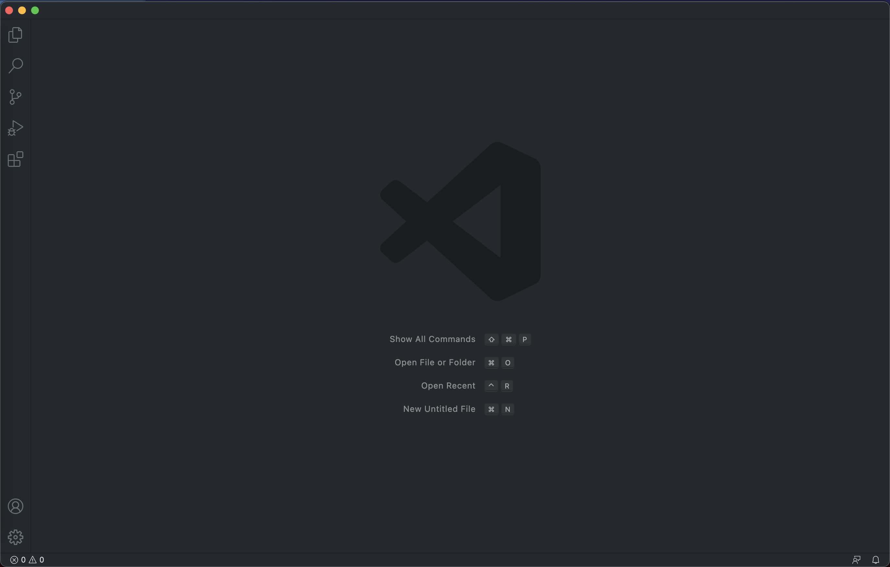
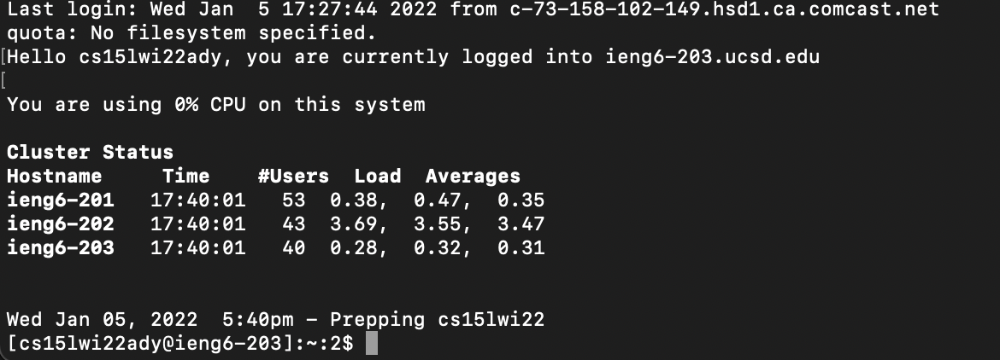
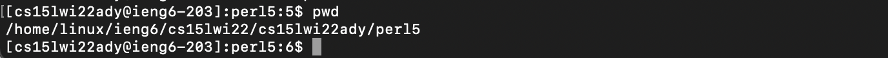
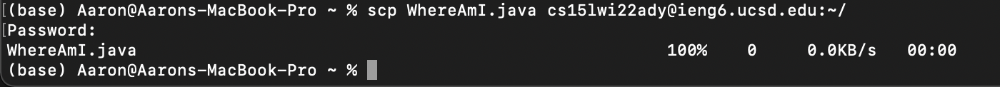
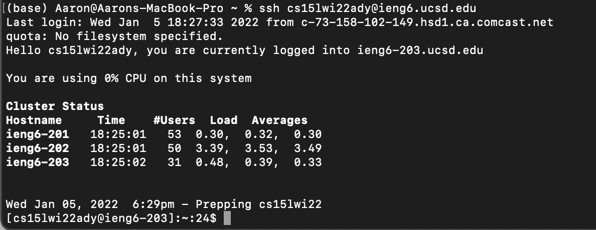
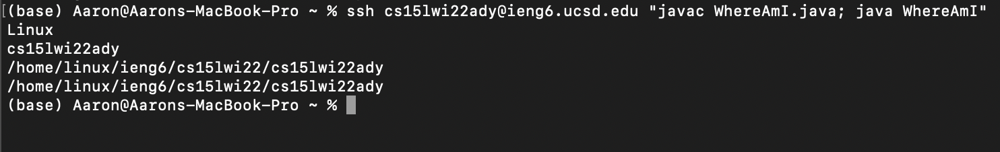

# Week 2 Lab Report

## 1. Installing Visual Studio Code

Go to [https://code.visualstudio.com/download](https://code.visualstudio.com/download) and download Visual Studio Code to your computer. When you first launch the app, the starting screen should look something like this:

___
## 2. Remotely Connecting

Firstly, open a new terminal. Type in the command

`$ ssh cs15lwi22zz@ieng6.ucsd.edu`

but replace `zz` with your personal account name (you can find it at [https://sdacs.ucsd.edu/~icc/index.php](https://sdacs.ucsd.edu/~icc/index.php)). 

Then, you will be prompted to type in your password. Once you are logged in, your terminal should look like this:

___
## 3. Try Some Commands

Now that you are remotely connected, play around with some terminal commands. Notice how they give different outputs than when you run the same commands locally. For example, here is what `$ pwd` looked like:

___
## 4. Moving Files with `scp`

One important command that you should learn is `scp`, which allows you to copy files between the local client and the server. 

Create a file locally called `WhereAmI.java` and type the command `$ scp WhereAmI.java cs15lwi22ady@ieng6.ucsd.edu:~/`, which copies the file to the root directory of the remote device. If successful, your terminal should look like this:

___
## 5. Setting an SSH Key

The purpose of this step is to eliminate the need to type your password every time you want to log in to `ieng6`.

To do so, create a public and private SSH key. Move the public key to the remote server with `scp`. You should now be able to log in without typing a password.

___

## 6. Optimize Remote Running

There are numerous ways to make using the remote server more pleasant and less time consuming, but I will only be discussing one here.

Suppose you want to log in to `ieng6` only to run a few commands. Instead of having to follow the three steps of logging in, running the commands, and logging out, you can combine all three steps into one.

For example, the command `$ ssh cs15lwi22ady@ieng6.ucsd.edu "javac WhereAmI.java; java WhereAmI"` will log in to the remote server, run the two commands specified in quotes, and immediately log out.

