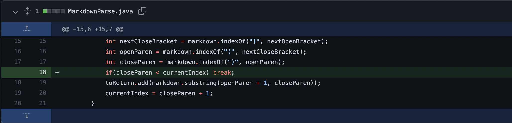
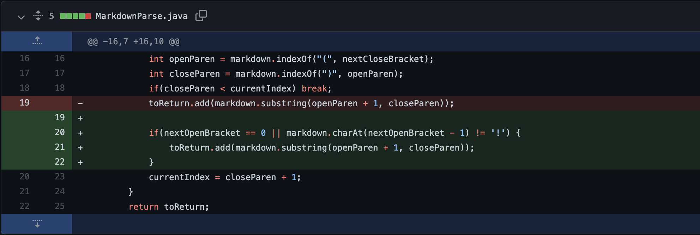
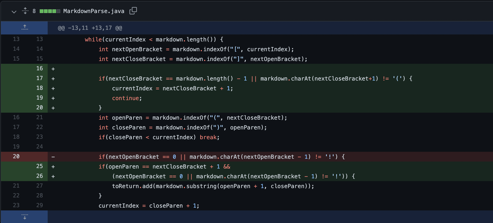

# Week 4 Lab Report

## First Change

The test file that prompted this change is [here](https://github.com/aaron-truong/markdown-parse/blob/main/breaking-test-file.md). 

The symptom is that the original program would not end, i.e. there was an infinite loop.

The bug came specifically from the code `int closeParen = markdown.indexOf(")", openParen)`. Since `indexOf()` cannot find any closed parentheses once `currentIndex` passes the first link, it returns -1, which causes `currentIndex` to reset to 0. Therefore, the loop continues indefinitely, as the while loop condition is always satisfied.

Adding the additional if statement ensures that we exit the loop if no more links are found.
___
## Second Change

The test file that prompted this change is [here](https://github.com/aaron-truong/markdown-parse/blob/main/breaking-test-file2.md). 

The symptom is that the original program outputs `[something.png]`, when the expected output is `[]`.

The bug arises from the fact that our program never differentiates between images and links. It simply checks for brackets followed by parentheses, which is a feature of both links and images. Therefore, any images in the markdown file will also be printed out.

Adding the if statement checks whether there is a `!` preceding the brackets, which is the defining feature of the image.
___
## Third Change

The test file that prompted this change is [here](https://github.com/aaron-truong/markdown-parse/blob/main/breaking-test-file3.md). 

The symptom is that the original program outputs `[Something in parentheses, something.com]`, when the expected output is `[sonething.com]`.

The bug arises from the fact that the program doesn't ensure that the open parentheses `(` is directly after the closed bracket `]`, which is a requirement for links. Therefore, text in parentheses that are not links will also be printed out.

Adding the if statement checks whether `nextClosedBracket` is preceding `openParen`, which is a defining feature of links.