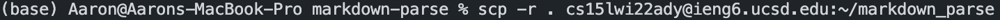
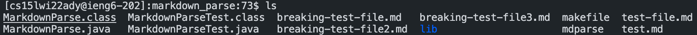
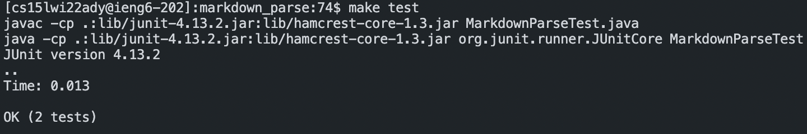
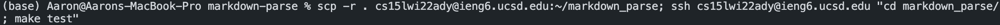
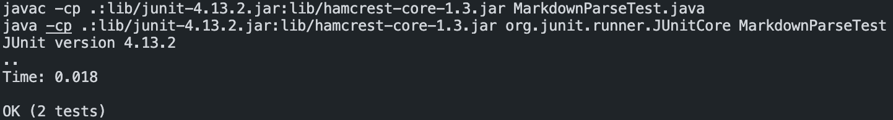

# Week 6 Lab Report

## Copying Whole Directories with `scp -r`

After running the command 

the `markdown_parse` directory in `ieng6` contains a copy of all the files:

I can now run tests from the `ieng6` server rather than from my own local device.

The command

combines all the previous steps, and results in the same test output:

