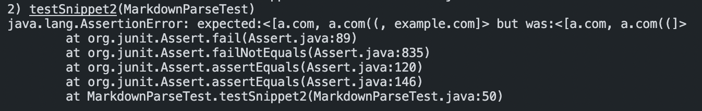

# Week 8 Lab Report

My MarkdownParse repository: https://github.com/aaron-truong/markdown-parse

Reviewed MarkdownParse repository: https://github.com/ucsd-cse15l-w22/markdown-parse

## Snippet 1

Based on the markdown file preview, the expected output should be ``[`google.com, google.com, ucsd.edu]``.

I created a JUnit test for Snippet 1 with the following code:

When run on my own MarkdownParse implementation, the test is not passed. The test failure is shown below:

When run on the implementation we reviewed, the test is also not passed. The test failure is shown below:

## Snippet 2

Based on the markdown file preview, the expected output should be ``[a.com, a.com((, example.com]``.

I created a JUnit test for Snippet 2 with the following code:

When run on my own MarkdownParse implementation, the test is not passed. The test failure is shown below:

When run on the implementation we reviewed, the test is also not passed. The test failure is shown below:

## Snippet 3

Based on the markdown file preview, the expected output should be ``[https://ucsd-cse15l-w22.github.io]``.

I created a JUnit test for Snippet 3 with the following code:

When run on my own MarkdownParse implementation, the test is not passed. The test failure is shown below:

When run on the implementation we reviewed, the test is also not passed. The test failure is shown below:

## Questions

1) One way to deal with the case of backticks is to detect any starting backticks with our current index. Then, we add another character search for an ending backtick. We move our current index past the ending backtick before looking for open brackets as we did previously. 

2) One way to deal with the case of escaped brackets is simply to check whether the character before `nextOpenBracket` and `nextCloseBracket` are a `\` or not. If they are, then we can move past these escaped characters and restart the process as usual.

3) One way to deal with the case of newlines is to add another character search for `\n`. If it is present before our closing bracket or closing parentheses, then we should not consider this as a link, and move our current index past `closeParen`.