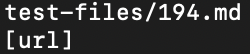
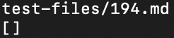
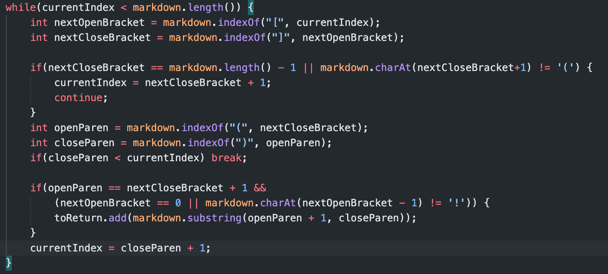
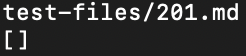
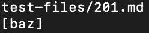
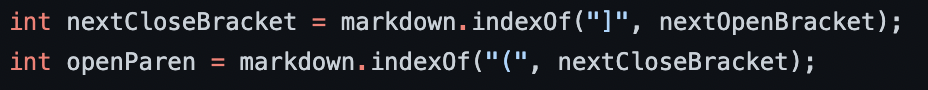

# Week 10 Lab Report

I found the tests with different results by redirecting the output of `script.sh` to a text file, then running diff on the two results. Then, I found the specific line in text file where the difference occurred in order to determine which test caused it.

## Test 194

My implementation gave the output 

and the other implementation gave the output

Neither implementation is correct, as the correct output should be `[my_(url)]`. 

The bug in my implementation is that I have not considered this alternative format of adding a link in a markdown file, where the link is given after a colon. I would have to add an additional check in the while loop of `getLinks` for this specific case:

## Test 201

My implementation gave the output

and the other implementation gave the output

The expected output should be `[]`, so my implementation was correct on this test while the other implementation wasn't.

The bug in the other implementation is that it does not detect whether a space occurs after the brackets, which causes the link to not be created. This could be fixed by adding an additional check that no space occurs between `openParen` and `nextCloseBracket`:

